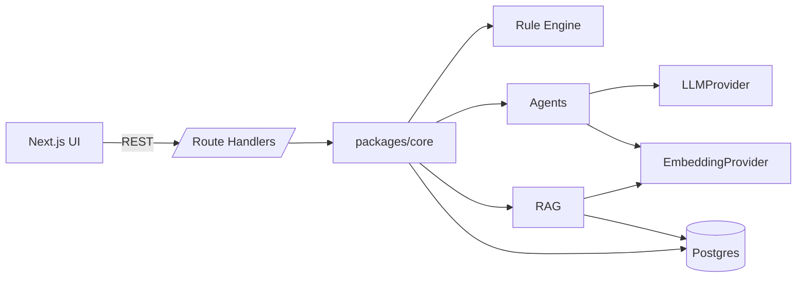

# Guardrail — Architecture (MVP)

Guardrail is a small monorepo. The whole system runs as one Next.js
process talking to one Postgres database.

## Repositories and packages

```
guardRails/
  apps/web/            # Next.js 15 App Router — pages + REST via Route Handlers
  packages/core/       # Domain, agents, RAG, DB, AI infra as a plain TS library
  docs/                # Plan, architecture, risk rules
  drizzle/             # Auto-generated SQL migrations (inside packages/core)
```

`apps/web` is a thin transport layer over `packages/core`. Server
Components fetch directly from the core library; client mutations go
through Route Handlers under `/api/*` so the same core call sites are
exercised regardless of who calls them.

## Runtime dependencies

- Node.js 20+
- Postgres 16+ (16.x tested; 18.x used locally). pgvector is **not required** —
  chunk embeddings are stored as `double precision[]` and cosine similarity
  is computed in application code. A production migration can flip this to
  `vector(dim)` for scale.
- No message broker, no Redis, no external queue.

## Analysis flow (deterministic workflow)

```
UI → POST /api/campaigns/:id/analyze
    → orchestrator.runAnalysis
        1. rule engine (deterministic)
        2. Compliance Agent  (LLM + RAG)
        3. Sentiment Agent   (LLM)
        4. Cultural Agent    (LLM + RAG, only if festival context is set)
        5. Audience Perspective Agent (LLM, one prompt many perspectives)
        6. Risk Aggregator   (deterministic)
        7. Recommendation Agent (LLM)
        8. Deterministic recommendation coverage (fills gaps)
        9. Persist + audit + set campaign status
```

Each step's success/failure is recorded in `audit_logs`. Findings, risks,
recommendations and audience perspectives are stored per `analysis_run` so
re-analysis produces a fresh set without discarding history.

## AI safety contract

- The rest of the codebase depends only on `LLMProvider` and
  `EmbeddingProvider` interfaces. Adapters:
  - `MockLLMProvider` — programmable fixtures (default for tests and offline
    demos)
  - `OpenAILLMProvider` — used when `LLM_PROVIDER=openai` + `OPENAI_API_KEY`
- Structured output is the default. Every LLM call uses `completeStructured`
  with a Zod schema; a JSON parse failure retries once, then throws
  `AIOutputInvalidError` (mapped to HTTP 502).
- `EvidenceStatus` enum forces every finding to declare one of:
  `SUPPORTED · INSUFFICIENT_EVIDENCE · CONTRADICTED · NOT_FOUND · REQUIRES_HUMAN_REVIEW · NOT_APPLICABLE`.
- The LLM never invents a citation. Evidence rows are constructed by the
  orchestrator from the retrieval result, keyed by an opaque `sourceId`
  string in the prompt; if the LLM returns an unknown `sourceId` it is
  dropped.

## RAG

- One tiny curated knowledge base at
  [`packages/core/src/knowledge/demo-kb.ts`](../packages/core/src/knowledge/demo-kb.ts).
  Every doc is fictional and labelled `[Fictional Demo]`.
- Chunker is deterministic (paragraph-greedy, target 800 chars).
- Retrieval computes cosine similarity in Node against
  `double precision[]` embeddings.
- Filters supported: `sourceType[]`, `geography`, `category`.
- If no chunks match a query, retrieval returns an empty list and the
  agents downgrade `evidenceStatus` accordingly.

## Human review

- A campaign that reaches any `humanReviewRequired = true` dimension is
  moved to `in_review`. A `human_reviews` row is created lazily via
  `POST /api/reviews`.
- Reviewers approve / reject / request changes via `PATCH /api/reviews/:id`.
- Every action lands in `audit_logs`.

## Feedback

- Optional client-side feedback endpoints under `/api/feedback` populate
  `feedback_events`.
- `/admin` shows: total events, disagreement rate (reject / total), and
  the 20 most recent finding-level actions.

## Not in the MVP

See [IMPLEMENTATION_PLAN.md](./IMPLEMENTATION_PLAN.md#11-mvp-exclusions).

## Diagram


